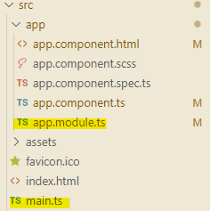
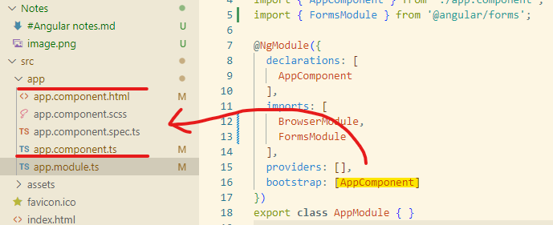
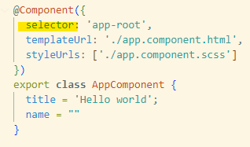

#Angular
Angular creates SPAs (single page applications)

Actual version Jully 2023 : angular 15
#How does Angular starts
When Angular gets started, the main.ts file gets started.

An Angular application is bootstraped, and this module is passed as an argument.
In this module, we tell Angular,
Hey, there is this AppComponent which Angular should know when it tries to start itself.

And Angular now analyzes the AppComponent,
reads the setup we pass here,
and therefore knows this selector app route.
And now Angular is able to handle app route in the index.html file,

and it knows, this is the selector.

because it was listed in this bootstrap array
in the app.module.

So now it knows that there,the AppComponent should be inserted .
## Selectors
angular apply its components by using selectors. these selectors are referenced into the component decorators. The value of these selectors can be either
- an html element (custom tag)
- a class
- a custom attribute

Exemple:
```js
@Component({
    selector: '[app-server]',
    // or
    selector: '.app-server.',
    // or
    selector: 'app-server'
})
```

**Limitations** : The Id slector is not supported because a component has to be reusable and an Id is designed to be unique. Also selectors by pseudo-classes will not work because they are too situational. Component are meant to be "static" and deterministic

# Directives
# property binding
## HostListener
## HostBinding
## Custom structural directives